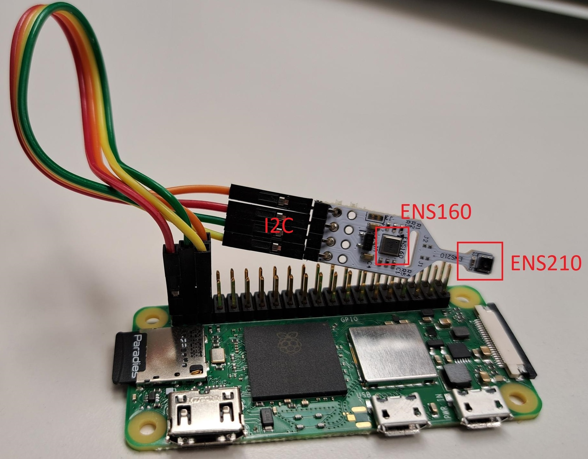

# Raspberry Pi based Gas Sensor & Weather Station Readout 

## Description

MOX Gas sensor and weather station WH2600 readout on Raspberry Pi Zero 2 in Python.


## Hardware

The Pi is connected via I2C to a ENS160 MOX gas sensor and a ENS210 temperature and humidity sensor. The pinout of the Pi header is described [here](https://pinout.xyz/pinout/i2c). 
The ENS160 and the ENS210 sensor are supplied with 3.3.V. The wiring of the sensors is shown in Fig. 1.

| Description | Pin #   | Color   |
| --------    | ------- | ------- |
| 3.3V        | 1       | red     |
| SDA         | 2       | green   |
| SCL/CLK     | 3       | yellow  |
| GND         | 6       | orange  |

The wheat

<figure>
  
  <figcaption>Fig. 1 Pi Zero and ENS Sensor wiring.</figcaption>
</figure> 

### I2C interface

The I2C interface must be enabled manually via the [raspi-config](https://www.raspberrypi.com/documentation/computers/configuration.html#raspi-config) 
```
sudo raspi-config
```

The I2C address of a connected I2C device can be checked with
```
sudo apt-get install i2c-tools
sudo i2cdetect -y 1
```
where 1 corresponds the the I2C interface 1


## Docker

Build the Python environment using

```
docker build -t measure_app . --platform=linux/arm/v7
```


## InfluxDB v1.x Handling

https://darkwolfcave.de/raspberry-pi-influxdb-backup-ganz-einfach-sichern/

- Load an influxdb database with name db_name using a time step formatting according to '2016-07-31T20:07:00Z' 
    ```
    influx -precision rfc3339 -database db_name
    ```

- List all measurements and field keys in the database with 
    ```
    show measurements 
    show field keys
    ```

- Use a Query to extract data form the database, e.g.,
    ```
    SELECT key from measurement
    ```

- Delete a measurement from the DB with
    ```
    drop MEASUREMENT measurement
    ```
    
- Use the WHERE statement in the query for filtering
    ```
    SELECT key from measurement WHERE time >= now() -1m
    SELECT R0 from ENS160 WHERE time >= now() -2m AND time <= now() -1m
    ```

- Export a database to a csv file with
    ```
    influx -database 'db_name' -execute "query" -format 'csv' > filename.csv
    ```
    where the query is given in quotes

- Check size of database (sensornode) via disk usage
    ```
    sudo du -sh influxdb/data/sensornode
    ```

# SSH Time Synchronization

``` 
ssh -i ~/.ssh/mimose-demo mimose-demo@hostname "sudo date -s '$(date)'"
```